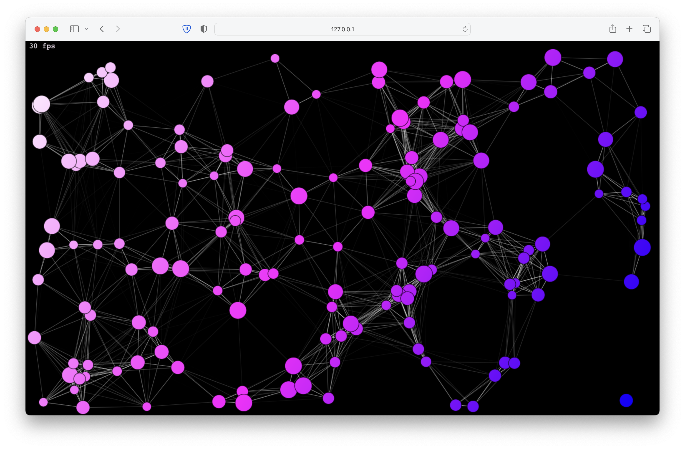

# JavaScript Animated Particles

Various particle effects using vanilla JavaScript.

Click on the canvas to push particles.

## References

- [Particle Effects Masterclass](https://www.youtube.com/playlist?list=PLYElE_rzEw_tLmWtIkUfI6Odi38ajFI8R)
- [MDN - Canvas tutorial](https://developer.mozilla.org/en-US/docs/Web/API/Canvas_API/Tutorial)
- [MDN - CSS hsl() function](https://developer.mozilla.org/en-US/docs/Web/CSS/color_value/hsl)
- [MDN - window.requestAnimationFrame()](https://developer.mozilla.org/ru/docs/Web/API/window/requestAnimationFrame)
